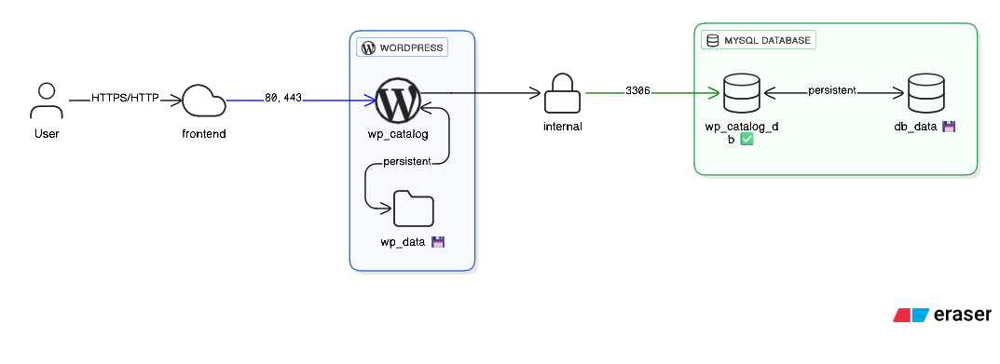

# 📦 WordPress Catalog

[](https://www.docker.com/)
[](https://wordpress.org/)
[](https://www.mysql.com/)
[](LICENSE)

A containerized WordPress catalog application with MySQL database and phpMyAdmin, ready to deploy with Docker Compose.

## ✨ Features

- 🚀 **One-command deployment** with Docker Compose
- 🔒 **Secure configuration** using environment variables
- 🏥 **Health checks** for reliable service startup
- 🌐 **Isolated networking** for enhanced security
- 💾 **Persistent data storage** with named volumes
- �️ **Enhanced Security** with WP 2FA and Really Simple Security
- 🔄 **Auto-restart** policies for high availability

## 🛠️ Tech Stack

- **WordPress** 6.8 - Content Management System
- **MySQL** 8.0 - Database Server
- **Docker** & **Docker Compose** - Containerization

## 📋 Prerequisites

Before you begin, ensure you have the following installed:

- [Docker](https://www.docker.com/get-started) (version 20.10 or higher)
- [Docker Compose](https://docs.docker.com/compose/install/) (version 2.0 or higher)

Verify your installation:

```bash
docker --version
docker compose version
```

## 🔗 Repository

**GitHub Repository**: [wp-catalog](https://github.com/yourusername/wp-catalog)

> 📝 **Note**: Update the repository URL above with your actual GitHub repository URL.

## 🚀 Quick Start

### 1. Clone the Repository

```bash
git clone https://github.com/yourusername/wp-catalog.git
cd wp-catalog
```

> 📝 **Note**: Replace `yourusername` with your GitHub username or use the repository URL from the section above.

### 2. Configure Environment Variables

Copy the example environment file and edit it with your credentials:

```bash
cp .env.example .env
```

Edit `.env` and set your secure passwords:

```env
WP_DB_NAME=wp_catalog
WP_DB_USER=wpuser
WP_DB_PASSWORD=your_strong_password_here
WP_80=80
WP_443=443
DOMAIN_NAME=your.domain.com

# MySQL Configuration
MYSQL_ROOT_PASSWORD=your_strong_root_password
MYSQL_DATABASE=${WP_DB_NAME}
MYSQL_USER=${WP_DB_USER}
MYSQL_PASSWORD=${WP_DB_PASSWORD}

# Backup Configuration (optional)
BACKUP_PATH=./backups
BACKUP_RETENTION_DAYS=7
BACKUP_TIMEZONE=your_timezone
```

> ⚠️ **Important**: Never commit the `.env` file to version control. It contains sensitive credentials.

### 3. Start the Services

```bash
docker compose up -d
```

This will:
- Pull the required Docker images
- Create named volumes for data persistence
- Set up the network
- Start all services in detached mode

### 4. Access Your WordPress Site

Once the containers are running and your domain is configured, access your WordPress installation:

- **HTTP**: `http://${DOMAIN_NAME}:${WP_80}`
- **HTTPS**: `https://${DOMAIN_NAME}:${WP_443}`

> 💡 **Note**: On first launch, WordPress will guide you through the installation wizard.
> 
> ⚠️ **Important**: Make sure your domain DNS is properly configured to point to your server's IP address.
>
> 🔒 **SSL Note**: If using the default ports (80/443), you can omit the port numbers from the URLs.

## 🧭 After Logging in to the WordPress Dashboard

Once you've completed the WordPress installation and logged into the admin dashboard, follow these steps to set up your product catalog:

### 1️⃣ Install the following plugins:

1. **WooCommerce**
   - Navigate to: Plugins → Add New
   - Search for "WooCommerce" and install the official WooCommerce plugin
   - Activate the plugin and follow the setup wizard

2. **YITH WooCommerce Catalog Mode**
   - Navigate to: Plugins → Add New
   - Search for "YITH WooCommerce Catalog Mode" and install
   - Activate the plugin

3. **Astra Theme**
   - Navigate to: Appearance → Themes → Add New
   - Search for "Astra" and install the theme
   - Activate the theme

4. **Advanced Custom Fields (ACF)**
   - Navigate to: Plugins → Add New
   - Search for "Advanced Custom Fields" and install
   - Activate the plugin

5. **WP 2FA**
   - Navigate to: Plugins → Add New
   - Search for "WP 2FA" and install the official plugin
   - Activate the plugin
   - Go to Settings → WP 2FA
   - Follow the setup wizard to configure 2FA for admin accounts
   - Enforce 2FA for all administrator accounts
   - Configure backup codes and recovery methods

6. **Really Simple SSL**
   - Navigate to: Plugins → Add New
   - Search for "Really Simple SSL" and install
   - Activate the plugin
   - Go to Settings → SSL
   - Follow the security recommendations
   - Enable HSTS if your site uses HTTPS
   - Configure mixed content fixer if needed

### 2️⃣ Configure the Product Catalog:

Go to: **Dashboard → WooCommerce → Settings → Catalog Mode**

Then:

- ✅ Enable "Hide Add to Cart"
- ✅ Disable all purchase and checkout options
- ✅ Optionally, add a "Request a Quote" or "Contact Us" button for inquiries

### 3️⃣ Customize the Product Page:

Go to: **ACF → Add Field Group**

Then add custom fields such as:

- **Brand** (Text)
- **Model** (Text)
- **Power** (Number)
- **Dimensions** (Text)
- **Datasheet** (File Upload)

> 💡 **Tip**: These custom fields will allow you to add detailed product specifications that are specific to your catalog needs.

## 📁 Project Structure

```
wp-catalog/
├── docker-compose.yml    # Docker Compose configuration
├── .env                  # Environment variables (not in git)
├── .env.example          # Environment template
├── .dockerignore         # Files to exclude from Docker context
├── .gitignore           # Git ignore rules
└── README.md            # This file
```

## 🔧 Configuration

### Port Configuration

Default ports are configured in `.env`:

- **HTTP Port**: `80` (configured via `WP_80`)
- **HTTPS Port**: `443` (configured via `WP_443`)
- **Domain Name**: Configure your domain via `DOMAIN_NAME` (e.g., www.example.com)

The WordPress container exposes:
- Port 80 for HTTP traffic
- Port 443 for HTTPS traffic
- Both ports are configurable through the `.env` file

MySQL runs on port 3306 internally and is not exposed outside the Docker network for security.

> 🔒 **Security Note**: The application uses Docker networks for isolation:
> - `frontend`: For web access
> - `internal`: For database connections (not exposed externally)

### Database Configuration

Database settings can be customized in `.env`:

- `WP_DB_USER`: WordPress database user
- `WP_DB_PASSWORD`: WordPress database password
- `WP_DB_NAME`: Database name
- `MYSQL_ROOT_PASSWORD`: MySQL root password
- `MYSQL_DATABASE`: Same as `WP_DB_NAME`
- `MYSQL_USER`: Same as `WP_DB_USER`
- `MYSQL_PASSWORD`: Same as `WP_DB_PASSWORD`

### Backup Configuration

Backup settings can be configured in `.env`:

- `BACKUP_PATH`: Local path for backups (default: `./backups`)
- `BACKUP_RETENTION_DAYS`: Number of days to keep backups (default: 7)
- `BACKUP_TIMEZONE`: Timezone for backup operations (e.g., `Africa/Cairo`)

### Using the Backup Script

The project includes an automated backup script `backup.sh` that creates a complete backup of both your database and WordPress files. To use it:

1. Make the script executable:
   ```bash
   chmod +x backup.sh
   ```

2. Run the backup:
   ```bash
   ./backup.sh
   ```

The script will:
- Create a `backups` directory if it doesn't exist
- Dump the MySQL database with timestamp (e.g., `db_2025-11-06-1430.sql`)
- Export WordPress files with timestamp (e.g., `wp_2025-11-06-1430`)
- Use environment variables from your `.env` file automatically

> 💡 **Tip**: Set up a cron job to run backups automatically:
> ```bash
> # Run backup daily at 2 AM
> 0 2 * * * cd /path/to/wp-catalog && ./backup.sh
> ```

> ⚠️ **Note**: Make sure to regularly transfer backups to a secure off-site location.

### Optional OCI Configuration

For Oracle Cloud Infrastructure backup integration, you can configure:

- `OCI_TENANCY_ID`: Your OCI tenancy OCID
- `OCI_USER_ID`: Your OCI user OCID
- `OCI_FINGERPRINT`: API key fingerprint
- `OCI_KEY_FILE`: Path to your API private key
- `OCI_REGION`: OCI region (e.g., `me-jeddah-1`)
- `OCI_BUCKET_NAME`: OCI bucket for backups
- `OCI_NAMESPACE`: Your OCI namespace

### Volumes

The following named volumes are created for data persistence:

- `wp_data`: WordPress installation and uploaded files
- `db_data`: MySQL database files

## 🏗️ Architecture

The following diagram illustrates the network architecture and port configuration:




```

```

## 🐳 Docker Services

### WordPress Service
- **Image**: `wordpress:latest`
- **Container**: `wp_catalog`
- **Ports**: 
  - HTTP: `${WP_80}:80` (default: 80)
  - HTTPS: `${WP_443}:443` (default: 443)
- **Volumes**: `wp_data:/var/www/html`
- **Networks**: internal, frontend
- **Health Check**: HTTP request test every 1 minute
- **Dependencies**: Requires healthy MySQL service

### MySQL Service
- **Image**: `mysql:8.0`
- **Container**: `wp_catalog_db`
- **Port**: Internal only (3306)
- **Volumes**: `db_data:/var/lib/mysql`
- **Networks**: internal only
- **Health Check**: MySQL ping test every 30 seconds
- **Environment**: Auto-configured from `.env` variables


## 📝 Common Commands

### View Running Containers

```bash
docker compose ps
```

### View Logs

```bash
# All services
docker compose logs

# Specific service
docker compose logs wordpress
docker compose logs db

# Follow logs
docker compose logs -f wordpress
```

### Stop Services

```bash
docker compose stop
```

### Start Services

```bash
docker compose start
```

### Restart Services

```bash
docker compose restart
```

### Stop and Remove Containers

```bash
docker compose down
```

### Stop and Remove Containers + Volumes

```bash
# ⚠️ WARNING: This will delete all data
docker compose down -v
```

### Rebuild Services

```bash
docker compose up -d --build
```

## 🔍 Troubleshooting

### WordPress Not Loading

1. Check if containers are running:
   ```bash
   docker compose ps
   ```

2. Check WordPress logs:
   ```bash
   docker compose logs wordpress
   ```

3. Verify database connection:
   ```bash
   docker compose logs db
   ```

### Database Connection Issues

1. Ensure the database container is healthy:
   ```bash
   docker compose ps db
   ```

2. Verify environment variables are set correctly in `.env`

3. Check MySQL logs:
   ```bash
   docker compose logs db
   ```

### Port Already in Use

If you get an error about ports being in use:

1. Change the ports in `.env`:
   ```env
   WP_PORT=8082
   PMA_PORT=8083
   ```

2. Or stop the service using the port:
   ```bash
   # Find process using port 8080 (Windows)
   netstat -ano | findstr :8080
   ```

### Reset Everything

To start fresh (⚠️ deletes all data):

```bash
docker compose down -v
docker volume prune
# Then start again
docker compose up -d
```

## 🔒 Security Best Practices

- ✅ Use strong, unique passwords in `.env`
- ✅ Never commit `.env` to version control
- ✅ Keep Docker images updated
- ✅ Use specific image versions (not `latest`)
- ✅ Regularly backup your volumes
- ✅ Review WordPress security plugins

## 💾 Backup & Restore

### Automatic Backup (Recommended)

Use the included backup script for automated backups:
```bash
./backup.sh
```

See [Using the Backup Script](#using-the-backup-script) section for detailed instructions.

### Manual Backup Commands

If you need to perform manual backups:

#### Backup Database
```bash
docker compose exec db mysqldump -u "$WP_DB_USER" -p"$WP_DB_PASSWORD" "$WP_DB_NAME" > "./backups/manual_db_$(date +%F-%H%M).sql"
```

#### Backup WordPress Files
```bash
docker compose cp wordpress:/var/www/html "./backups/manual_wp_$(date +%F-%H%M)"
```

### Restore Database
```bash
docker compose exec -T db mysql -u "$WP_DB_USER" -p"$WP_DB_PASSWORD" "$WP_DB_NAME" < "backup_file.sql"
```

> 💡 **Tip**: The automatic backup script is the recommended method as it handles both database and files in one step.

## 🤝 Contributing

Contributions are welcome! Please feel free to submit a Pull Request.

For questions or suggestions, contact the maintainer:

- **Email**: [amr.marey@msn.com](mailto:amr.marey@msn.com)

### How to Contribute

1. Fork the repository
2. Create your feature branch (`git checkout -b feature/AmazingFeature`)
3. Commit your changes (`git commit -m 'Add some AmazingFeature'`)
4. Push to the branch (`git push origin feature/AmazingFeature`)
5. Open a Pull Request

We appreciate your contributions! 🎉

## 📄 License

This project is licensed under the MIT License - see the [LICENSE](LICENSE) file for details.

## 🙏 Acknowledgments

- [WordPress](https://wordpress.org/) - Open source CMS
- [MySQL](https://www.mysql.com/) - Database server
- [Docker](https://www.docker.com/) - Containerization platform
- [WP 2FA](https://www.wpwhitesecurity.com/wordpress-plugins/wp-2fa/) - Two-factor authentication
- [Really Simple SSL](https://really-simple-ssl.com/) - SSL/TLS security

---

⭐ If you find this project helpful, please give it a star!

Made with ❤️ using Docker and WordPress
